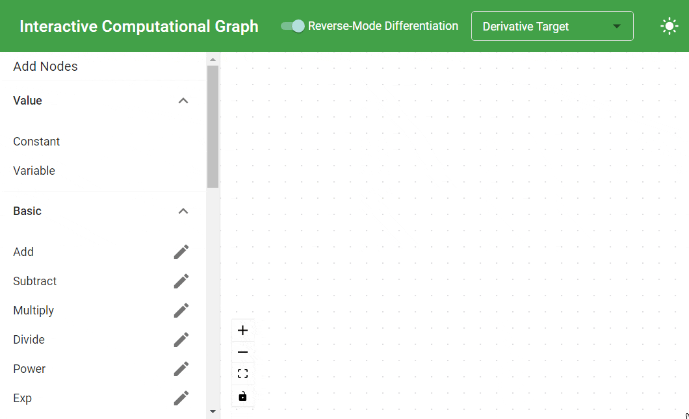

# Interactive Computational Graph

A small educational React website to understand how computational graph and derivatives work. I created this tool because I couldn't fully understand how back-propagation works in neural networks.

## Development

VSCode can be used to develop the website.

If you use VSCode, please open the subdirectory `./interactive-computational-graph` in a new Window and enable the extensions like ESLint in the new window. Otherwise, we have to set up some extra settings if we open a VSCode window here.

### Recommended VSCode Extensions

- Jest: Runs Jest tests
- Code Spell Checker: Checks common spelling errors
- ESLint: Lints Typescript files
- Stylelint: Lints CSS files
- PrettierL: Formats Typescript files
- Markdown Preview Mermaid Support: Previews Mermaid graphs in Markdown files
