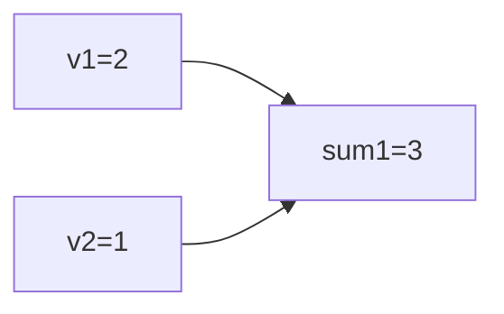
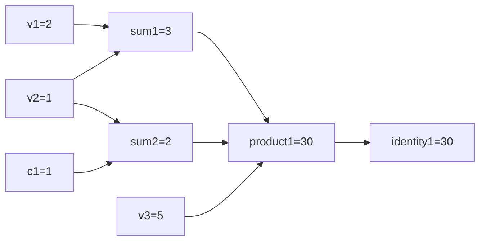
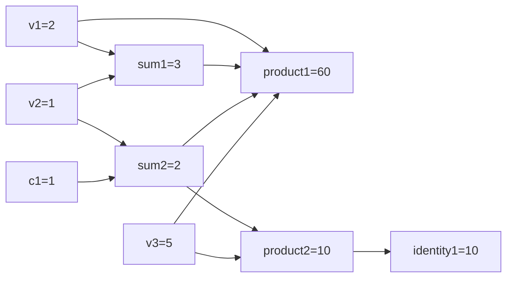
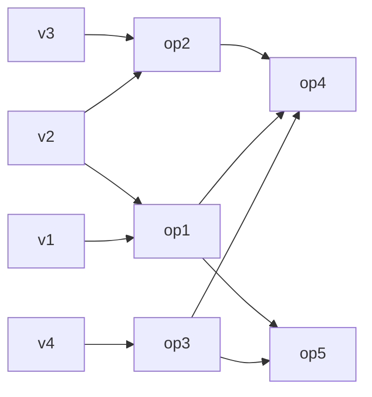
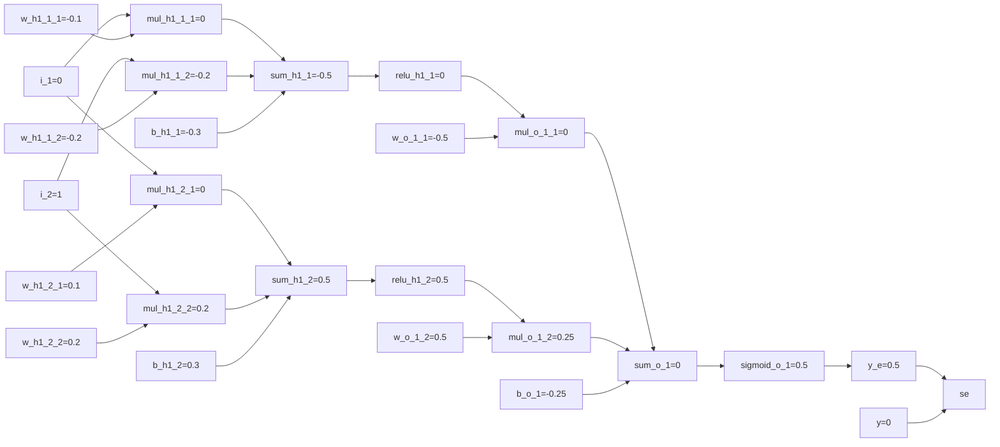

# Graph.test Documentation

## Small Graph

## Medium Graph

## Complex Graph

## Multi-Output Graph

This graph is used mostly in the comments.

## Neural Network Graph

This fully connected neural network has the following traits:
- 2 inputs
- 1 hidden layer with 2 neurons and ReLU activation
- 1 output with sigmoid activation and MSE loss function

The notations:
- `i_{x}`: `x`-th input
- `{op}_{l}_{x}_{y}`: Operation `op` for layer `l` that connects `x`-th neuron in the current layer to `y`-th input/neuron in the previous layer
    - `{l}==h{n}`: `n`-th hidden layer
    - `{l}==o`: Output layer
    - `{op}==mul`: Multiplication function that multiplies `mul_{l}_{x}_{y}` in the current layer and `y`-th input/neuron in the previous layer
    - `{op}==sum`: Sum function that adds all `mul_{l}_{x}_{y}` for each `y` and bias `b_{l}_{x}`
    - `{op}==relu`: ReLU activation function for `sum_{l}_{x}`
    - `{op}==sigmoid`: Sigmoid activation function for `sum_l_x`
- `w_{l}_{x}_{y}`: Weight for operation `mul_{l}_{x}_{y}`
- `b_{l}_{x}`: Bias for operation `sum_{l}_{x}`
- `y_e`: The estimate `y` value
- `y`: The true `y` value
- `se`: Squared error function which outputs the loss (MSE with 1 sample data)

