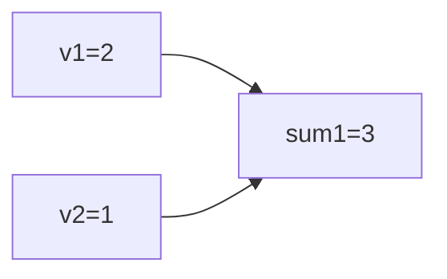
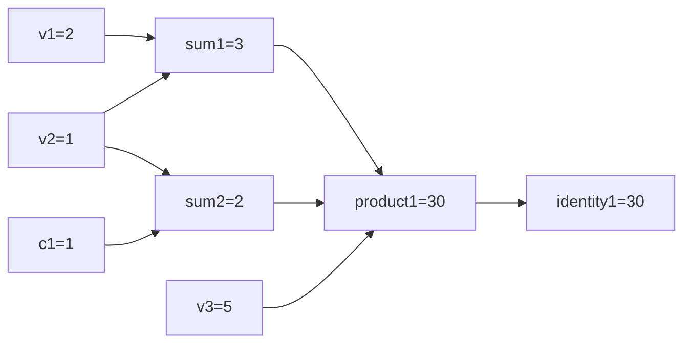
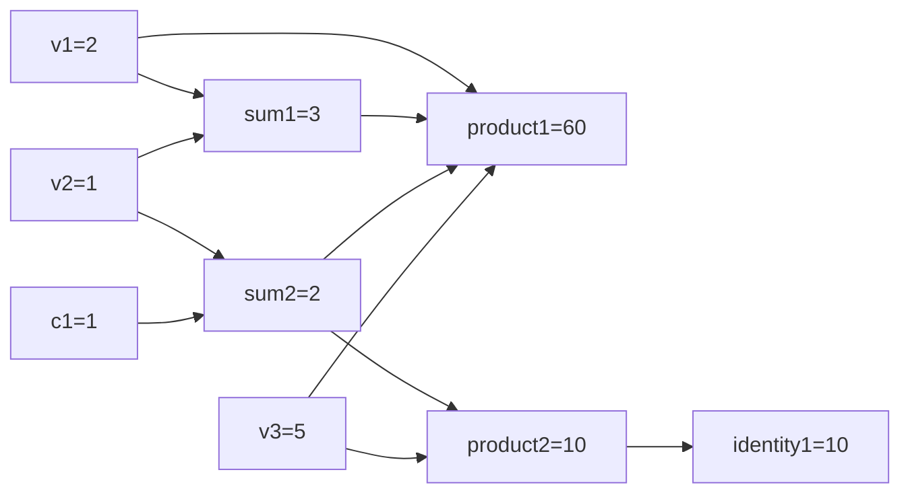

# Graph.test Documentation

## Small Graph

```mermaid
flowchart LR
    v1[v1=2] --> sum1[sum1=3]
    v2[v2=1] --> sum1
```

## Medium Graph

```mermaid
flowchart LR
    %% Layer 1
    v1[v1=2] --> sum1[sum1=3]
    v2[v2=1] --> sum1
    v2 --> sum2[sum2=2]
    c1[c1=1] --> sum2
    %% Layer 2
    sum1 --> product1[product1=30]
    sum2 --> product1
    v3[v3=5] --> product1
    %% Layer 3
    product1 --> identity1[identity1=30]
```

## Complex Graph

```mermaid
flowchart LR
    %% Layer 1
    v1[v1=2] --> sum1[sum1=3]
    v2[v2=1] --> sum1
    v2 --> sum2[sum2=2]
    c1[c1=1] --> sum2
    %% Layer 2
    v1 --> product1[product1=60]
    sum1 --> product1
    sum2 --> product1
    v3[v3=5] --> product1
    sum2 --> product2[product2=10]
    v3 --> product2
    %% Layer 3
    product2 --> identity1[identity1=10]
```
