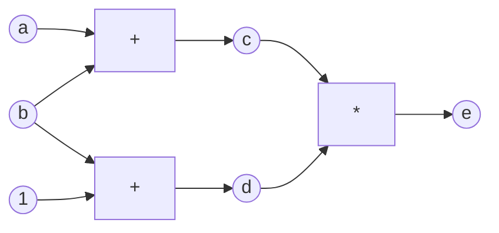
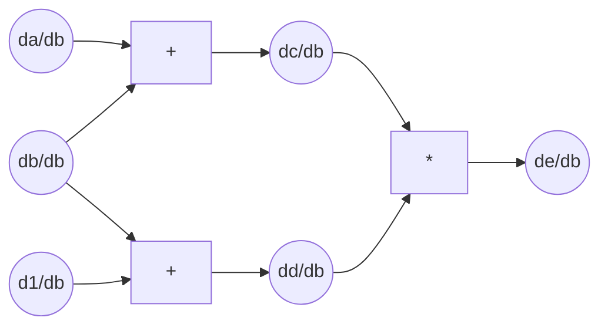

# Graphs

## Simple Example

### Graph

- $ c = a + b $
- $ d = b + 1 $
- $ e = c*d = (a+b)*(b+1) $

### Forward-mode differentiation (w.r.t. $ b $):

- $ \frac{\partial{a}}{\partial{b}} = 0 $
- $ \frac{\partial{b}}{\partial{b}} = 1 $
- $ \frac{\partial{1}}{\partial{b}} = 0 $
- $ \frac{\partial{c}}{\partial{b}} = \frac{\partial{(a)}}{\partial{b}} \frac{\partial{c}}{\partial{(a)}} + \frac{\partial{(b)}}{\partial{b}} \frac{\partial{c}}{\partial{(b)}} = 0 * 1 + 1 * 1 = 1 $
- $ \frac{\partial{d}}{\partial{b}} = \frac{\partial{(1)}}{\partial{b}} \frac{\partial{d}}{\partial{(1)}} + \frac{\partial{(b)}}{\partial{b}} \frac{\partial{d}}{\partial{(b)}} = 0 * 0 + 1 * 1 = 1 $
- $ \frac{\partial{e}}{\partial{b}} = \frac{\partial{(c)}}{\partial{b}} \frac{\partial{e}}{\partial{(c)}} + \frac{\partial{(d)}}{\partial{b}} \frac{\partial{e}}{\partial{(d)}} = 1 * d + 1 * c = d + c $

### Reverse-mode differentiation (w.r.t. $ e $):

- $ \frac{\partial{e}}{\partial{e}} = 1 $
- $ \frac{\partial{e}}{\partial{c}} = \frac{\partial{(e)}}{\partial{c}} \frac{\partial{e}}{\partial{(e)}} = d * 1 = d $
- $ \frac{\partial{e}}{\partial{d}} = \frac{\partial{(e)}}{\partial{d}} \frac{\partial{e}}{\partial{(e)}} = c * 1 = c $
- $ \frac{\partial{e}}{\partial{a}} = \frac{\partial{(c)}}{\partial{a}} \frac{\partial{e}}{\partial{(c)}} = 1 * d = d $
- $ \frac{\partial{e}}{\partial{b}} = \frac{\partial{(c)}}{\partial{b}} \frac{\partial{e}}{\partial{(c)}} + \frac{\partial{(d)}}{\partial{b}} \frac{\partial{e}}{\partial{(d)}} = 1 * d + 1 * c = d + c $
- $ \frac{\partial{e}}{\partial{1}} = \frac{\partial{(d)}}{\partial{1}} \frac{\partial{e}}{\partial{(d)}} = 0 * c = 0 $

